<p align="center">
  
</p>

<div align="center">

# Hi 👋 I'm Upendra Adhikari

### Computer Engineering Student • React Developer • Python Enthusiast


</div>

---

# 🚀 About Me

```yaml
Name       : Upendra Adhikari
Location   : Nepal
University : Tribhuvan University
Degree     : Bachelor in Computer Engineering
Current    : Learning React + Python
Interest   : AI | Web Development | Cybersecurity
Status     : Open to work
```

---

# 💻 Tech Stack

<p align="center">
  
</p>

---

# 📊 GitHub Analytics

<!-- <p align="center">
  
  
</p> -->

<p align="center">
  
</p>

---

# 🐍 Contribution Snake

<p align="center">
  
</p>

---

# 🤝 Connect With Me

<p align="center">
  <a href="https://github.com/Upendraadk">
    
  </a>

  <a href="https://linkedin.com/in/upendra-adhikari-710647399">
    
  </a>
</p>

---

<div align="center">

### ⭐ Thanks for visiting my profile!

*"Code. Learn. Build. Repeat."*

</div>
